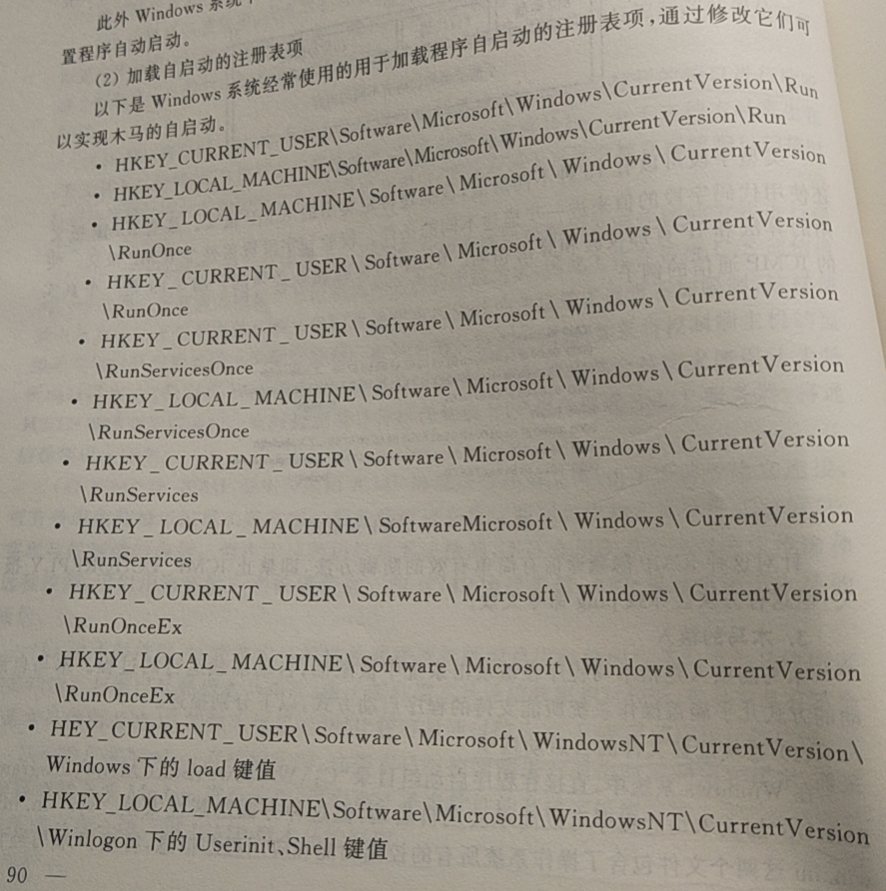
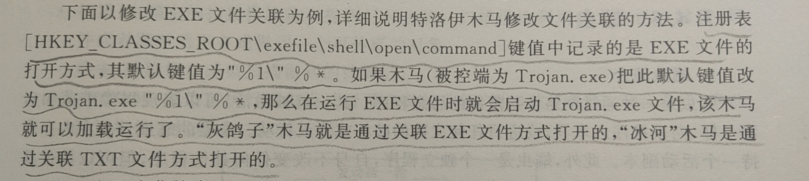

# 《信息安全管理·第二版》自我学习
徐爱国陈秀波郭燕惠著-北京邮电大学出版社

## 第一章 绪论

CIH病毒：陈盈豪，台湾大学生。CIH病毒属文件型病毒，杀伤力极强。主要表现在于病毒发作后，硬盘数据全部丢失，甚至主板上BIOS中的原内容也会被彻底破坏，主机无法启动。只有更换BIOS，或是向固定在主板上的BIOS中重新写入原来版本的程序，才能解决问题。

爱虫病毒：可以改写本地及网络硬盘上面的某些文件。用户机器染毒以后，邮件系统将会变慢，并可能导致整个网络系统崩溃。

[Kerberos存取控制](https://yq.aliyun.com/articles/738246)

入侵检测系统（IDS）：从计算机网络或计算机系统中的若干关键点搜集信息并对其进行分析，从中发现网络或者系统中是否有违反安全策略行为和遭到攻击迹象的一种机制。采用旁路侦听，通过对数据包流的分析，从数据流中过滤出数据包，通过与已知的入侵方式进行比较，确定入侵是否发生以及入侵的类型并进行报警。入侵检测的目的是提供网络活动的监测、审计、证据以及报告。
* 已完成使用snort体验入侵检测的实验

现在主流三种网关：协议网关、应用网关、安全网关。

## 第二章 信息安全风险评估
* 脆弱点是资产本身存在的，如果没有相应的威胁出现，单纯的脆弱点本身不会对资产造成损害。脆弱点主要表现在技术和管理两方面。

常见的风险评估方法：基线风险评估、详细风险评估、综合风险评估。
* 综合风险评估方法步骤：高层风险分析---基线风险分析或详细风险分析---防护措施的选取---风险接受---IT系统安全策略---IT安全计划。
* 综合风险评估方法种类：综合指数法（加权平均计算综合指数值）、功效评分法、TOPSIS法、层次分析法、主成分分析法、聚类分析法（样品聚类分析和变量聚类分析）。其中权值的选取使用其他方法。

资产评估两原则：最大原则、加权原则。

风险评估方法分为：定量方法（用具体的货币表示形式的损失值来分析和度量风险，主要有基于期望损失的方法和基于期望损失效用的方法等）和定性方法（基于一定的定量方法，在定量方法的基础上进行裁剪和简化，有风险矩阵测量、威胁分级法、风险综合评价等）。定量方法需要大量的数据支持，现实较多使用定性。

概率风险分析：故障树分析法FTA（分析大型复杂系统，自顶向下的方法）、故障模式影响和危害程度分析方法FMECA（自下而上）、危害及可操作性研究分析方法HazOp（专家组，HazOp分析方法的主要目的：识别出存在的问题，生成结果是一个可能危害的列表，对每个危害，需要对可能的原因及后果进行进一步的评估）、马尔可夫分析法（描述随机过程，无后效性）。

模糊决策：引入隶属度的概念。

## 第三章 系统与网络安全

OSI/RM七层模型：  
1. 应用层---做什么
2. 表示层---像什么
3. 会话层---如何检查
4. 传输层---对方在何处
5. 网络层---数据如何到达对方
6. 链路层---下一步该怎么走
7. 物理层---信息实际如何传送

TCP/IP四个功能层：
1. 应用层：提供各种符合各种不同需求和特性的管理服务和应用服务  
2. 传输层：提供端到端的数据传输。通信子网指网络层和以下各层。功能：数据流分段和提供可靠传输。协议主要：UDP和TCP。对应OSI/RM中的会话层和传输层。  
3. 网络层：IP层。功能：分组转发和路由选择，实现点对点互连。IP协议无连接，不可靠，转发设备路由器不必保存任何有关数据流的状态，可以大大提高分组转发的效率。
* IP（Internet Protocol）：为传送层提供网络服务  
ICMP（Internet Control Message Protocol）：报告错误信息和其他应注意的情况  
ARP（Address Resolution Protocol）：将IP地址转换为物理地址  
RARP（Reverse Address Resolution Protocol）：将物理地址转换为IP网络地址
4. 数据链路层：网路接口层，实现网络中相邻设备之间的互连。定义各种介质的物理连接的特性，及其在不同介质上的信息帧格式。
* 用户数据在传输层称为段，网络层称为数据报，链路层称为帧。
 
TCP/IP安全  
1. 网络层问题  
1）IP路由欺骗  
2）ARP欺骗  
3）Smurf:将目标地址设置成广播地址，从而放大攻击实现拒绝服务攻击。 
* 解决:丢弃边界数据包。 
4）死亡之Ping:现在已没有，网站限制了数据包大小，超过数值连接超时。原理：发送的数据包超过路由器最大尺寸，导致系统协议栈崩溃或最终系统死机。  
5）Teardrop:人为设计数据包，使重组时导致操作系统异常。
2. 传输层问题  
1）Land拒绝服务攻击：伪造SYN数据包让目标主机不断给自己发送消息，空连接多了造成拒绝服务攻击。  
2）TCP会话劫持:TCP成功连接后没有认证机制，认为数据包序列号正确数据就是可以接受的，因此会有假冒。  
3）SYN Flood攻击：当前最流行（此书2011年9月）Dos和DDoS攻击方式之一，利用TCP协议缺陷，发送大量伪造的TCP连接请求，使得被攻击方资源耗尽。
* 解决原始SYN flood攻击：  
1.缩短SYN Timeout时间，快速响应  
2.设置SYN Cookie,如果短时间同一个IP发送大量数据包，则丢弃
* 另一个解决：半开TCP连接，确保缓冲区永远不会被填满  
4）分布式拒绝服务攻击：攻击分为攻击者、主控端、代理端三层
3. 应用层问题  
DNS（伪造DNS请求、查询应答和查询标识符来实现。有局限性，因为DNS缓存有生存期以及无法替换DNS缓存中已存在记录，可再次验证IP地址来防范）和HTTP两方面

木马的植入
1. 系统配置文件的自启动选项  
在StartUp文件夹下加入木马程序，但隐蔽性差。system.ini([386Enh字段]中driver=，以及[mic][drivers][drivers32][boot]字段)和win.ini（Load=和Run=选项），类似还有Autoexec.bat,config.sys,Autorun.inf  
2. 加载自启动的注册表项  
 
3. 通过修改文件关联加载  
双击时自动启动，偷换处理程序为木马程序

蠕虫病毒三模块：扫描模块、感染模块、执行功能模块。
* CodeRed、CodeRed II、CodeRed III已了解，windows版本已发展不适用了。

防火墙  
分类  
1. 包过滤防火墙：通常时一台有能力过滤数据包某些内容的路由器。几乎不再需要费用，不能阻止所有类型的攻击。  
2. 应用级网关：又称代理防火墙或应用网关，在应用层处理信息，实现了对用户请求的连接而不是设备进行认证，比包过滤防火墙和状态防火墙提供了更多的流量控制。
3. 状态检测防火墙：能实现连接的跟踪功能。
4. 电路级网关：监控受信任的客户或服务器与不受信任的主机间的TCP握手信息，来决定该会话是否合法。  

体系结构    
1. 双重宿主主机体系结构：外网和内部网络的中间，特点：1）IP层的通信是被组织的，两个网络之间的通信可通过应用层数据共享或应用层代理服务来完成。2）网络地址翻译NAT：将一个IP地址用另一个IP地址来代替，可以实现“单向路由”。
* 地址翻译NAT应用场景：  
  1.希望隐藏内网IP  
  2.内网的IP无效，因为IP不够用
2. 被屏蔽主机体系结构：由包过滤路由器和堡垒主机组成，比包过滤防火墙安全等级高，实现了网络层安全和应用层安全。  
3. 被屏蔽子网体系结构：两个屏蔽路由器，分别位于周边网和内网、周边网和外网之间，形成隔离带。  

VPN  
远程访问VPN、内联网VPN、外联网VPN
IPsec:IP层，两者运行模式：传输和隧道
SSL：SSL连接：点对点的暂时关系。SSL会话：客户与服务器之间的一个关联。分为握手层和记录层。SSL主要目的：在两个通信应用程序之间提供私密性和可靠性。

入侵检测：基于主机和基于网络
## 第4章 物理安全
辐射发射：被处理的信息会通过计算机内部产生的电磁波向空中发射  
传导发射：含有信息的电磁波也可以通过计算机内部产生的电磁波向空中发射。
* 早期有对信号进行接受和还原来窃听

## 第5章 信息系统安全审计

安全审计概念和计算机取证

## 第6章 灾难恢复和业务连续性

备份策略：完全备份、增量备份、差分备份、综合型完全备份。
* 增量备份和差分备份的基准时间不同

## 第7章 信息安全标准

组织、标准、信息技术安全性评估通用准则CC、ISO/IEC 2700系列标准介绍

## 第8章 信息安全法律法规
立法、司法、执法三组织

我国信息安全法律法规体系

计算机犯罪

知识产权

电子商务
* 电子签名

其余各国信息安全法律法规
## 自学总结
贴合CISSP？以后可能会有用。

