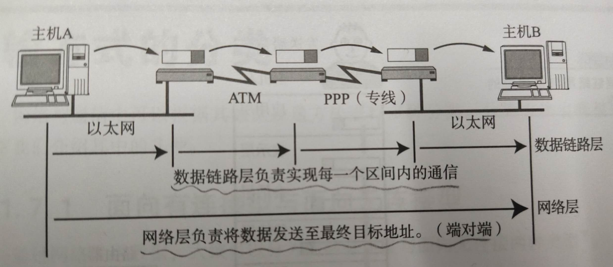
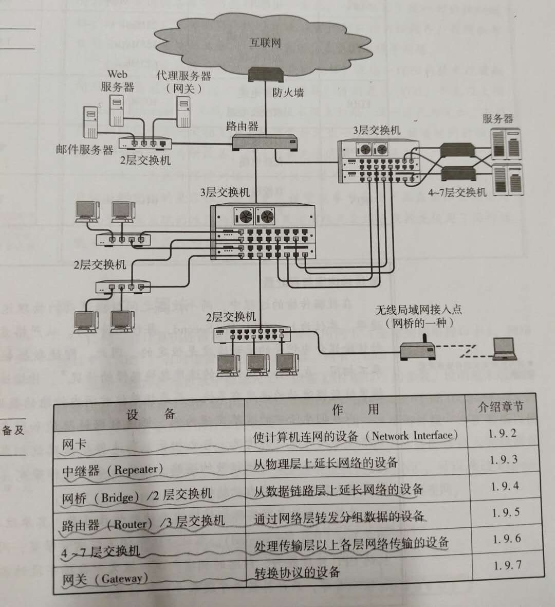

# 《图解TCP/IP》自我学习
## 第1章 网络基础知识
协议：计算机与计算机之间通过网络实现通信时事先达成的一种约定。

OSI协议\OSI模型\OSI产品\OSI通信区分
OSI参考模型:应用层（根据用户需求选择特别的协议）---表示层（将数据从主机特有的格式转换为网络标准传输格式）---会话层（采用哪个连接发送，何时建立连接、何时发送数据，并不实际传输数据）---传输层（确立连接与断开连接重发，在通信两端进行确认，确保数据传输的可靠性）---网络层（数据通信处理，端对端）---数据链路层（在通过传输介质互连的设备之间进行数据传输）---物理层（将数据的0、1转换为电压和脉冲光传输给物理的传输介质，而相互直连的设备之间使用mac地址实现传输）。  
* 会话层主要负责决定建立和断开连接的时机，传输层进行实际的建立和断开处理。                     
* 网络层负责将整个数据发送给最终目标地址，数据链路层只负责发送一个分段内的数据。
* mac地址目的：识别连接到同一个传输介质上的设备。

接口：上下层之间进行交互时所遵循的约定。协议：同一层之间交互所遵循的约定。节点：按照OSI的惯例，进行通信的计算机称为节点。在TCP/IP中被称为主机。

面向有连接型：在通信传输之前，先打开一个连接，连接被关闭时无法发送数据。包括以太网、IP、UDP等协议。  
* 在面向有连接型的情况下，发送端的数据不一定要分组发送。  

面向无连接型：无需确认对端是否存在，发送端可随时发送数据。协议包括ATM、帧中继、TCP等协议。  

* 在不同的分层协议中，连接的具体含义有所不同。数据链路层指物理的、通信线路的连接。传输层则负责创建与管理逻辑上的连接。

为了解决一台计算机收发信息独占整个电路的问题，产生分组交换，提高通信线路的利用率。  

mac寻址参考地址转发表(根据自学自动生成)，ip寻址参考路由控制表（根据路由协议自动生成）  

传输速率：在数据传输的过程中，两个设备之间数据流动的物理速度，单位bps。传输速率又称作带宽，带宽越大网络传输能力越强。
* 吞吐量：主机之间实际的传输速率，单位也是bps。吞吐量不仅衡量带宽，同时也衡量主机的CPU处理能力、网络的拥堵程度、报文中数据字段的占有份额等信息。

中继器：OSI模型第一层（物理层）上延长网络的设备，对减弱的信号进行放大和发送，不负责判断数据是否有错误，一般中继器的两端连接的是相同的通信媒介，不能在传输速度不同的媒介之间转发，连接两个不同速度的网络需要的是网桥或路由器这样的设备。
* 中继集线器：简称集线器或Hub,可以看作是多口中继器，每个端口都可以成为一个中继器。

## 第2章 TCP/IP基础知识

## 第3章 数据链路

## 第4章 IP协议

## 第5章 IP协议相关技术

## 第6章 TCP与UDP

## 第7章 路由协议

## 第8章 应用协议

## 第9章 网络安全

消息：应用之间交互的信息。应用协议定义这些消息的格式以及使用这些消息进行控制或操作的规则。

shell:操作系统提供给用户的、便于使用该系统中各种功能的一种用户接口。比如UNIX中的sh、csh、bash,windows中的explorer,mac os中的finder。

telnet基本服务：一是仿真终端功能，二是协商选项功能。
* 由于路由器和交换机一般都不配备键盘和显示器，对他们进行设置，既可以通过串行线，也可以通过telnet、http、snmp等协议。
* telnet通常连接23端口，使用telnetd程序。21-ftp。25-smtp.80-http.110-pop3.每个服务器都有相应的端口号在等待连接。
* windows vista系统以后命令行的telnet功能默认是关闭的，需要单独安装才能使用。
* ftp 主机名=telnet 主机名 21

SSH：加密的远程登录系统。

FTP  
匿名服务器：一种ftp服务器，允许任何人访问，登录时使用匿名或ftp。  
FTP工作机制：两条TCP连接：一条TCP21端口用来控制（利用这个连接，可以通过ASCII码字符串发送请求和接收应答，且每次GET(RETR)\PUT(STOR)\LIST等操作建立一个用于数据传输的TCP连接）；另一条，与控制相反的方向建立用于数据传输，现在为了安全，普遍数据传输的端口号进行随机分配，之前常见20端口。
* NAT连接外部TCP服务器时，无法直接建立传输数据时使用的TCP连接，必须使用PASV修改建立连接方向。（这句话没看懂，命令不清楚，原理不懂得）
* 有对应的命令和应答消息，类比Http理解

SMTP：发送邮件的协议，使用tcp25端口，客户端以文本的形式发出请求，服务端返回一个3位数字的应答，每个指令和应答的最后都必须追加换行指令（CR、LF）。
* 一开始TCP发送邮件，但双方都必须插电且联网
发送和接收都通过邮件服务器进行收发邮件，接收端从邮件服务器接收邮件时使用POP3协议。电子邮件机制三部分：邮件地址、数据格式、发送协议。
* 邮件地址：名称@通信地址，其中通信地址为子网名称.域名。电子邮件的发送地址由DNS进行管理，DNS注册有邮件地址及其作为发送地址时对应的邮件服务器的域名，这些映射关系被称作MX记录。  
* 现在数据类型扩展到MIME，MIME由首部和正文组成，可以将多个MIME消息组合成为一个MIME消息。
* POP before SMTP或SMTP认证等，可以防止冒充发送者。
* telnet 服务器名或其IP地址 25

POP：接收邮件的协议。
* telnet 服务器名或其IP地址 110

IMAP：接收电子邮件的协议。
* POP的邮件客户端管理，IMAP邮件由服务器管理。
## 总结
通俗易懂，举例恰当，概念区分解释得很清楚，科普性书籍很好。