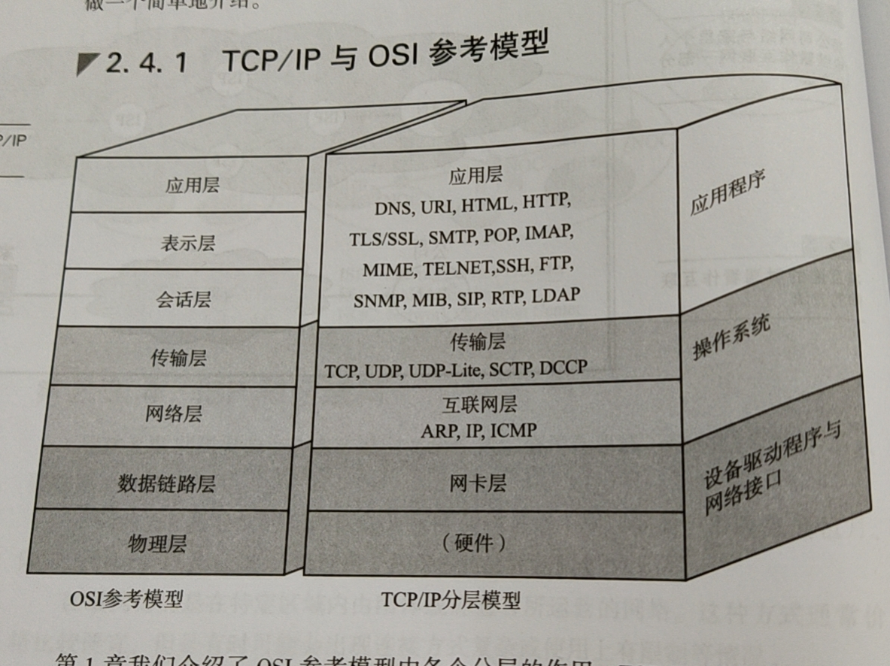
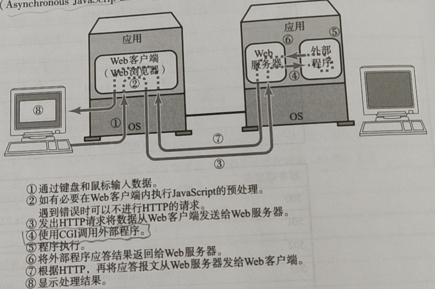
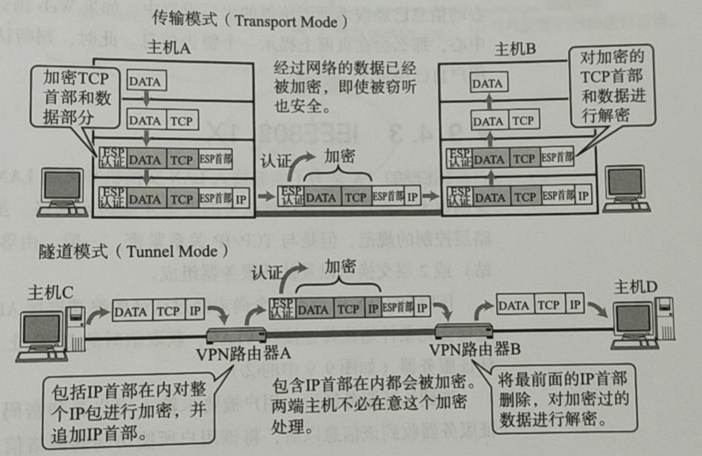
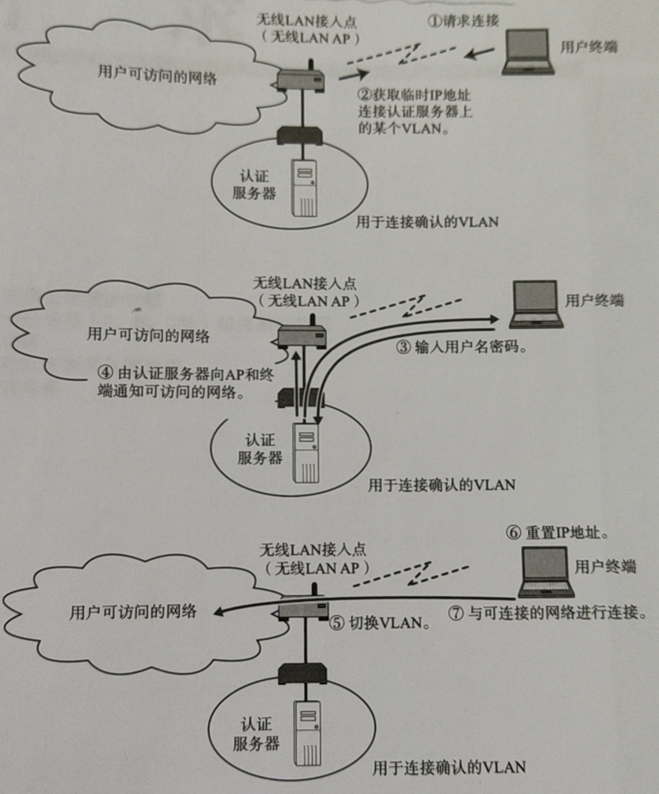

# 《图解TCP/IP》自我学习
## 第1章 网络基础知识
协议：计算机与计算机之间通过网络实现通信时事先达成的一种约定。

OSI协议\OSI模型\OSI产品\OSI通信区分
OSI参考模型:应用层（根据用户需求选择特别的协议）---表示层（将数据从主机特有的格式转换为网络标准传输格式）---会话层（采用哪个连接发送，何时建立连接、何时发送数据，并不实际传输数据）---传输层（确立连接与断开连接重发，在通信两端进行确认，确保数据传输的可靠性）---网络层（数据通信处理，端对端）---数据链路层（在通过传输介质互连的设备之间进行数据传输）---物理层（将数据的0、1转换为电压和脉冲光传输给物理的传输介质，而相互直连的设备之间使用mac地址实现传输）。  
* 会话层主要负责决定建立和断开连接的时机，传输层进行实际的建立和断开处理。                     
* 网络层负责将整个数据发送给最终目标地址，数据链路层只负责发送一个分段内的数据。
* 如何区别理解OSI应用层和表示层？浏览器与服务器之间通信所用协议http(属于应用层)，传输的数据的主要格式html(属于表示层)。又比如，MIME也属于表示层。
* mac地址目的：识别连接到同一个传输介质上的设备。

接口：上下层之间进行交互时所遵循的约定。协议：同一层之间交互所遵循的约定。节点：按照OSI的惯例，进行通信的计算机称为节点。在TCP/IP中被称为主机。

面向有连接型：在通信传输之前，先打开一个连接，连接被关闭时无法发送数据。包括以太网、IP、UDP等协议。  
* 在面向有连接型的情况下，发送端的数据不一定要分组发送。  

面向无连接型：无需确认对端是否存在，发送端可随时发送数据。协议包括ATM、帧中继、TCP等协议。  

* 在不同的分层协议中，连接的具体含义有所不同。数据链路层指物理的、通信线路的连接。传输层则负责创建与管理逻辑上的连接。

为了解决一台计算机收发信息独占整个电路的问题，产生分组交换，提高通信线路的利用率。  

mac寻址参考地址转发表(根据自学自动生成)，ip寻址参考路由控制表（根据路由协议自动生成）  

传输速率：在数据传输的过程中，两个设备之间数据流动的物理速度，单位bps。传输速率又称作带宽，带宽越大网络传输能力越强。
* 吞吐量：主机之间实际的传输速率，单位也是bps。吞吐量不仅衡量带宽，同时也衡量主机的CPU处理能力、网络的拥堵程度、报文中数据字段的占有份额等信息。

网卡：网络适配器、网卡、LAN卡。  

中继器：OSI模型第一层（物理层）上延长网络的设备，对减弱的信号进行放大和发送，不负责判断数据是否有错误，一般中继器的两端连接的是相同的通信媒介，不能在传输速度不同的媒介之间转发，连接两个不同速度的网络需要的是网桥或路由器这样的设备。
* 中继集线器：简称集线器或Hub,可以看作是多口中继器，每个端口都可以成为一个中继器。

网桥/2层交换机：连接一个网络与另一个网络，能够识别数据链路层中的数据帧，根据数据帧的内容转发数据给相邻的其他网络，没有连接网段个数的限制，基本上只用于连接相同类型的网络，有时可以连接传输速率不同的网络。
* 数据链路的数据帧中有一个数据位叫FCS，用以校验数据是否正确送达目的地。检查这个域中的值，将那些损坏的数据丢弃，从而避免发送给其他的网段。
* 用CRC（循环冗余校验码）方式校验数据帧中的位。
* 网桥还能通过地址自学机制和过滤功能控制网络流量。
* 自学式网桥：能够判断是否将数据报文转发给相邻的网段。
* 交换集线器：具有网桥功能的Hub，交换集线器中连接电缆的每个端口都能提供类似网桥的功能。集线器：只有中继器功能的Hub。

路由器/3层交换机：连接网络与网络的设备，将分组报文发送给另一个目标路由器地址，基本上可以连接任意两个数据链路。
* 网桥根据物理地址（mac地址）进行处理，路由器根据ip地址进行处理。
* 路由器有分担网络负荷的作用，有些路由器具备一定的网络安全功能。

4~7交换机：负责处理OSI模型中从传输层至应用层的数据。负载均衡是向多个服务器分散压力的4~7层交换机的一种，通过DNS实现。
* 循环复用DNS技术：通过对多个IP地址配置同一个名字，每次查询到这个名字的客户得到其中的某一个地址，从而使不同客户访问不同的服务器。

网关：协议翻译和转发数据，使用应用网关（在同一种类型的协议之间转发数据）或表示层。

## 第2章 TCP/IP基础知识

阿帕网ARPANET的由来

TCP/IP标准化  
TCP/IP标准化过程特点：开放性和注重实用性。  
TCP/IP协议由IETF讨论制定，需要标准化的协议，被人们列入RFC。STD方式管理RFC编号，使得同一个协议的规范内容即便发生了变化也不会导致STD编号发送变化。  
* RFC：征求意见表，记录了协议规范内容，还包含了协议的实现和运用的相关信息。RFC编码既定，若成为某一RFC的内容，不可随意修改，修改要新发，并明确规定扩展了哪个已有RFC以及作废哪个RFC。
* FYI：协议实现或运用相关的信息
TCP/IP标准化流程：互联网草案阶段---计入RFC，提议标准阶段---草案标准阶段---标准阶段
* TCP/IP标准化并非标准以后才应用，而是称为标准那一刻为止，之前已经被充分试验。
* RFC中的实验性协议：实验性质的协议，而非以标准化为目的的协议
* RFC、SYD、FYI、ID都可获取

TCP/IP是为使用互联网而开发制定的协议族。互联网协议就是TCP/IP,TCP/IP就是互联网的协议。
* Intranet:使用Internet技术，企业内部封闭网络。
* 互联网就是众多异构网络通过IX（网络交换中心）连接而成的巨型网络。其中每个网络都由骨干网和末端网组成。  

               
1. 物理层：TCP/IP是在网络互联的设备之间能够通信的前提下下被提出的协议。  
2. 数据链路层（网络接口层）：驱动程序是操作系统与硬件之间起桥梁作用的软件。  
3. 网络层：TCP/IP分层中的互联网层与传输层的功能通常由操作系统提供。
* IP：分组交换的协议，隐含数据链路层的功能，不具有重发机制，非可靠传输协议。
* ICMP：发生异常有通知，可用来诊断网络健康状况。  
* ARP：从分组数据报的IP地址中解析出物理地址。
4. 传输层：让应用程序之间实现通信，分清哪些程序在通信以及识别应用程序的端口号。
* TCP：为了建立与断开连接，至少7次收发包，浪费流量，不适合视频会议等场合。  
  UDP：用于分组数据较少或多播、广播通信以及视频通信等多媒体领域。
5. 应用层：TCP/IP应用的架构绝大多数属于客户端/服务端模型。有HTTP、FTP、SNMP、SSH、TELNET、SMTP等

## 第3章 数据链路

## 第4章 IP协议

## 第5章 IP协议相关技术

## 第6章 TCP与UDP

## 第7章 路由协议

## 第8章 应用协议

消息：应用之间交互的信息。应用协议定义这些消息的格式以及使用这些消息进行控制或操作的规则。

shell:操作系统提供给用户的、便于使用该系统中各种功能的一种用户接口。比如UNIX中的sh、csh、bash,windows中的explorer,mac os中的finder。

协议  
1. telnet基本服务：一是仿真终端功能，二是协商选项功能。
* 由于路由器和交换机一般都不配备键盘和显示器，对他们进行设置，既可以通过串行线，也可以通过telnet、http、snmp等协议。
* telnet通常连接23端口，使用telnetd程序。21-ftp。25-smtp.80-http.110-pop3.每个服务器都有相应的端口号在等待连接。
* windows vista系统以后命令行的telnet功能默认是关闭的，需要单独安装才能使用。
* ftp 主机名=telnet 主机名 21

2.SSH：加密的远程登录系统。

3. FTP  
匿名服务器：一种ftp服务器，允许任何人访问，登录时使用匿名或ftp。  
FTP工作机制：两条TCP连接：一条TCP21端口用来控制（利用这个连接，可以通过ASCII码字符串发送请求和接收应答，且每次GET(RETR)\PUT(STOR)\LIST等操作建立一个用于数据传输的TCP连接）；另一条，与控制相反的方向建立用于数据传输，现在为了安全，普遍数据传输的端口号进行随机分配，之前常见20端口。
* NAT连接外部TCP服务器时，无法直接建立传输数据时使用的TCP连接，必须使用PASV修改建立连接方向。（这句话没看懂，命令不清楚，原理不懂得）
* 有对应的命令和应答消息，类比Http理解

4. SMTP：发送邮件的协议，使用tcp25端口，客户端以文本的形式发出请求，服务端返回一个3位数字的应答，每个指令和应答的最后都必须追加换行指令（CR、LF）。
* 一开始TCP发送邮件，但双方都必须插电且联网
发送和接收都通过邮件服务器进行收发邮件，接收端从邮件服务器接收邮件时使用POP3协议。电子邮件机制三部分：邮件地址、数据格式、发送协议。
* 邮件地址：名称@通信地址，其中通信地址为子网名称.域名。电子邮件的发送地址由DNS进行管理，DNS注册有邮件地址及其作为发送地址时对应的邮件服务器的域名，这些映射关系被称作MX记录。  
* 现在数据类型扩展到MIME，MIME由首部和正文组成，可以将多个MIME消息组合成为一个MIME消息。
* POP before SMTP或SMTP认证等，可以防止冒充发送者。
* telnet 服务器名或其IP地址 25

5. POP：接收邮件的协议。
* telnet 服务器名或其IP地址 110

6. IMAP：接收电子邮件的协议。
* POP的邮件客户端管理，IMAP邮件由服务器管理。

[URI、URL、URN区别](https://www.php.cn/div-tutorial-413616.html)

[http1.0,http1.1,http2.0区别](https://www.cnblogs.com/heluan/p/8620312.html)  

CGI：Web服务器调用外部程序时所使用的一种服务端应用的规范。
* 外部程序并不仅局限于使用CGI启动，它也有可能被包含在Web服务器内部的程序里，或是嵌入了解释器的Web服务器程序里。

[RSS](https://baike.baidu.com/item/rss/24470)

内存映射I/O：向内存中特定的地址写入信息，也可以读取内存中特定地址中的内容，这些过程叫内存映射I/O。  

SNMP:基于UDP/IP的协议，利用SNMP可以对连接到网络的设备进行远程管理。SNMP中的交互信息叫MIB（监控网络中某个设备接口或某个点的众多参数构成）。RMON由监控网络上线路的众多参数构成，可用于判断当前网络是否被充分利用。  

多媒体通信实现技术：H.323协议、SIP协议、RTP协议、数字压缩协议、P2P协议、LDAP协议。
* PRT协议：UDP实现实时的多媒体通信需要附加一个表示报文顺序的序列号字段，还需要对报文发送时间进行管理。RTCP协议：辅助RTP的一种协议，通过丢包率等线路质量的管理，对RTP的数据传送率进行控制。
* P2P：在服务器与客户端分离型的环境中，服务器要在一个可以由互联网直接访问的地方，而客户端即使是在NAT内侧也不会有问题。但是在P2P中，必须具备从互联网越过NAT令双方终端能够访问的功能。

## 第9章 网络安全

防火墙：可以避免域内受到非法访问，建立tcp连接的请求只允许从内网发起，因此只能从内网向外建立连接，不能从外网直接连接内网。  

IDS入侵检测系统：检查已经侵入内部网络进行非法访问的情况，并及时通知给网络管理员的系统。
* DMZ非军事化区：将外网与内网隔开的专用子网。DMZ对外公开，可以排除外部过来的非法访问。

IDM：一种集合各种终端、服务器和应用的认证于一起进行综合管理的技术。

在构建VPN时，最常被使用的就是IPsec,在IP首部后面追加'封装安全有效载荷'和'认证首部'，从而对此后的数据进行加密，不被盗取者轻易解读。  

http与https的区别：使用TLS/SSL加密的http通信叫https通信。  

IEEE802.1X是为了能够接入LAN交换机和无线LAN接入点而对用户进行认证的技术。是一个提供数据链路层控制的规范，由客户端终端、AP（无线基站）、或2层交换机以及认证服务器构成。IEEE802.1X使用EAP（可扩展身份认证协议），认证过程如下图。   

## 总结
通俗易懂，举例恰当，概念区分解释得很清楚，科普性书籍很好。