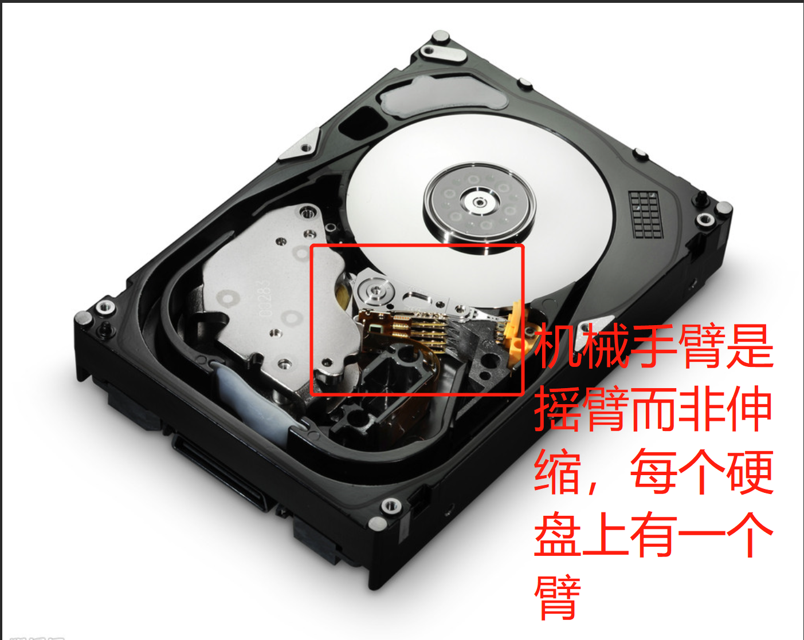

# 《鸟哥的LINUX私房菜》自我学习

## 第一部分 LINUX的规则与安装

### 第0章 计算机概论

 EeePC:华硕公司发布的一款便携移动终端设备，产品定位移动互联，用户通过它可以随时收发email。现已停产。

#### 02 个人计算机架构与接口设备

CPU：分为精简指令集RISC和复杂指令集CISC.
* 目前世界上使用范围最广的CPU可能就是ARM了。
* x86与x86_64的由来
* 不同x86架构的cpu，除了CPU的整体结构不同，主要在于微指令集不同。先进的微指令集可以加速多媒体程序的运行，也能够加强虚拟化的性能，而且某些微指令集更能够增加能源效率，让CPU耗电量降低。（于是理解了为什么早期的电脑处理速度慢，有的PC很快没有电，后来Intel广告中会出现超长待机。每一个技术都能搜索到能够大致让人理解，具体怎么精准实现的就不是字面能解释了。）

计算机分类：超级计算机、大型计算机、迷你计算机、工作站、微电脑。
* 工作站计算机强调稳定不死机，并且运算过程完全。而个人计算机运算速度较快。

1Byte=8bit
* CPU运算单位MHz或GHz.网络Mbit/s.传输速度1MB/s/125KB/s.(ADSL:上行速率和下行速率的非对称,实现数字信号与模拟信号能同时在电话线传输，ISP（网络服务提供商）以客户端（下行通道）传输的带宽比较高，客户端到ISP（上行通道）的传输带宽比较低，即接受的数据量远远大于送出去的数据量)

CPU：芯片组分为两个桥接器来控制个组件通信，Intel芯片：北桥负责连接CPU、内存和显卡；南桥负责连接周边接口（包括硬盘、USB、网卡等）；AMD将内存控制组件集成到CPU中，内存直接与CPU通信不通过北桥，加速。北桥总线成为系统总线，是内存传输的主要信道，速度较快（内存与CPU的通信速度靠的是外部频率）;南桥是输入输出总线。总线频宽=FSB（北桥所支持的频率，称为前端总线速度）x总线宽度（每次传送的位数），因此常见的总线宽度为32/64位。
* 字组大小：CPU每次能够处理的数据量。字组大小可以与总线宽度不相同，此时以CPU的字组大小来称呼该架构。例-Pentium Pro.
* CPU有不同的脚位，搭配不同的主板芯片组。CPU有等级，向下兼容。  
CPU频率=外频（CPU与外部组件进行数据传输/运算时的速度）x倍频(CPU内部用来加速工作性能的一个倍数)
* 不同的CPU不能单纯以频率来判断运算性能，因为每个CPU的微指令集不同，架构不同，每次频率能够进行的工作指令数也不同，频率仅能用来比较同款CPU的速度。
* 超频：CPU倍数通常出厂时已被锁定无法修改，因此被超频的是外频。由于并非正常频率，可能会造成死机等。

内存：主要组件为动态随机访问内存DRAM（挥发性内存）
* 突起是防止前后脚位安插错误
* DRAM发展出现SDRAM、DDR SDRAM、DDR、DDRII、DDRIII等，DDR双倍数据传送速度，比SDRAM块。
* 内存型号的挑选与CPU及芯片组有关，购买主板、CPU和内存时要考虑相关性。
* 内存除了要考虑频率/频宽，还有容量。内存越大表示系统越快，因为不需要常常释放内存数据。
* 理论上，CPU与内存的外频应该相同

* 后期发展，集成静态随机访问内存SRAM到CPU上成为了高速缓存cache

* BIOS是一套写死在主板上只读存储器ROM中的程序，在没有通电时也能够将数据记录下来，BIOS掌握了系统硬件的详细信息与开机设备的选择等，为了适应科技发展代码也需要修改，但是由于ROM无法修改，现在BIOS的程序一般卸载山润或EEPROM（带电可擦可编程只读存储器。掉电后数据不丢失的存储芯片。 EEPROM 可以在电脑上或专用设备上擦除已有信息，重新编程。即插即用）中。开机时都需要去读取BIOS中的一个小程序。
* BIOS（程序）区别于CMOS（芯片，RAM芯片，由系统通过一块后备电池供电（主板上有一个电池）,因此无论是在关机状态中,还是遇到系统掉电情况,CMOS信息都不会丢失）CMOS:记录主板上面的重要参数（系统时间、CPU电压与频率、各个设备的I/O地址与IRQ等）由一个备用电池供电。BIOS在开机时执行的程序，加载CMOS中的参数，并尝试调用存储设备中的开机程序，进一步进入操作系统中。BIOS可以更改CMOS中的数据，每种主板调用BIOS的按键不同。·

显卡：又称为VGA，其中的内存容量音箱屏幕分辨率和色彩深度，嵌入3D加速芯片以后称为GPU。

硬盘与存储设备：每个扇区固定大小512bytes，扇区组成一个圆成为磁道，多硬盘上，所有盘片的同一个磁道组成一个柱面，柱面是分割硬盘的最小单位。[硬盘原理详解](https://blog.csdn.net/hguisu/article/details/7408047)
* 多个硬盘如何读写？机械手臂是一组，每个硬盘上都有一个机械手臂。

* 硬盘存储量=header数量x每个header负责的柱面数量x每个柱面所含有的扇区数量x扇区容量。
* 碎片的产生和碎片整理
* KMGTP二进制与十进制有区别，解释了为什么500GB硬盘实际只有466GB
硬盘与主机系统接口规格：IDE接口、SATA接口、SCSI接口
* IDE接口宽，接两个，需要跳针区分主从；SATA接口小，连一个设备，速度快，有利于主机壳内部的散热和安装；SCSI接口运转速度快，不会耗费CPU资源。
* 购买硬盘考虑：与主板对应的插槽接口、容量、缓冲存储器越大越好、转速
* 计算机通电后最好不要移动和拍打

PCI适配卡：安插用户有额外需要的功能卡
* 要安装新的网卡时，要特别注意标准的区别。

主板
* 每个地址都有自己的地址
* IRQ中断：各设备通过IRQ中断信道来告知CPU该设备的工作情况，以方便CPU进行工作分配任务。中断共享sharing IRQ:空出无用的周边接口。
* 与其他设备的接口：PS/2、USB、声音输出、输入与麦克风、RJ-45、com1、LPT1

电源：电源本身也会吃掉一部分电力。

#### 03 数据表示方式
英文编码ASCII系统，中文编码big5(简体gb2312)，big5可以定义2^16=65536个字，但实际没有定义这么多，因此有了造字程序（只能本机使用）

#### 04软件程序运行
编译器的由来：程序不可移植、程序具有专一性，产生编译器，避免和硬件打交道。

#### 操作系统
产生目的：克服硬件方面老是需要重复编写句柄的问题。 

操作系统内核kernel：一组管理计算机的所有活动以及驱动系统中所有硬件的程序。受保护，开机后常驻内存中。内核参考硬件规格写成，因此硬件架构不一样，操作系统程序也不一样，即硬件不一样，内核就要相应修改。操作系统只是让主机准备好，因此需要应用程序来明确运行的功能，应用程序的开发参考操作系统提供的接口，因此不同的操作系统开发出来的应用程序不可以相互使用。

#### 第0章重点总结
计算机五大单元：输入单元、输出单元、CPU内部的控制单元、算术逻辑单元、内存。

数据流进/流出内存是CPU发出的控制命令，CPU要处理的数据完全来自内存。

北桥系统总线，数据较快，南桥输入/输出总线。

BIOS与CMOS

硬盘组成:盘片、机械手臂、磁头、主轴马达。盘片组成：扇区、磁道、柱面。

操作系统是程序，是软件。

### 第1章 Linux是什么

[Multics](https://www.multicians.org/)

一个关于UNIX（BSD-UNIX like）,MINIX,GNU项目（GPL授权模式、GCC、Emacs、GLIBC、Bash shell、FSF）,LINUX的故事。  
&emsp;&emsp;分时操作系统CTSS---Multics项目想要发展壮大CTSS---为了太空旅游游戏产生的汇编语言写成的Unics---改进B语言后C语言写成的UNIX，产生分支BSD---UNIX收回版权，产生收费的Minix(mini Unix)。同时，GNU产生，推出GCC(编译器)、Emacs（编辑器，纠错）,成立FSF（自由软件基金会）---参考Minix基于Intel386加入bash环境和gcc等编译程序的linux0.02内核---linux参考POSIX标准（针对UNIX与一些软件运行时的标准）改进能够与UNIX兼容共享---linux开放壮大，模块化，有了版本和distributions
* 理解GPL的Free。linux是因为FTP网站目录linux,企鹅因为被咬了。CLE项目开发套件对linux汉化。
* Linux版本与distributions:  
  linux版本编号是指kernel内核版本：主版本.次版本。释出版本-修改版本。主次版本为奇，2.5.xx,开发中；为偶，2.6.xx,稳定版。  
  linux distribution可完全安装套件或linux发布商套件=kernel+softwares+tools。规范distributions的标准：LSB、FHS。distributions分为两大类：1.RPM方式安装软件的Red Hat、Fedora、SuSE等。2.使用dkpg安装方式的Debian、Ubuntu、B2D等。商业推荐Red Hat、SuSE等。个人推荐：Fedora、Ubuntu、OpenSuSE等

硬件基础上开发内核，每种操作系统内核不同，Windows没有办法可以安装到MAC上。
* LINUX具有可移植性。搜寻很多网络教程发现确实如此，如果mac和windows双系统就要使用软件（虚拟环境），而windows与linux，只需要不同的操作系统在不同磁盘上，当然虚拟环境的使用也是支持的。

[X Window System](https://baike.baidu.com/item/X-WINDOW/2769585
)与X windows(没找到是什么，猜测是想表达一种操作系统)不同。

Open Source(GNU、BSD、Apache)与Close Source(Freeware、Shareware)

### 第2章 Linux如何学习

#### 学习心态
你要耐得住寂寞，要有刻苦耐劳的精神。

手机上的Linux了解网站：[LiMo基金会](http://www.limofoundation.org/)、[Linux手机论坛](http://www.lipsforum.org/)、[OpenMoko网站](http://www.openmoko.com/)、[Google手机平台](http://code.google.com/android/)

嵌入式系统需要linux kernel+驱动程序结合，[酷学园](www.study-area.org)

要怎么收获就怎么栽。

不论学什么系统，“从头学起”是很重要的。

必备知识：  
1.计算机概论和硬件相关知识    
2.从LINUX安装和命令开始  
3.linux操作系统的基础技能：用户/用户组的概念、权限的观念、程序的定义、权限的概念，需要了解系统。  
4.学会vi  
5.shell即shell脚本：命令行界面就是一个名为shell的软件,shell中的软件很多：正则表达式、管道命令、数据流重定向等  
6.会软件管理员：用于安装驱动程序或者安装额外软件，tarball/rpm/dpkg等  
7.网络基础：IP概念、路由概念等  
[计算机基础](http://www.study-area.org/compu/compu.htm)  
[网络基础](http://www.study-area.org/network/network.htm)

一本好的工具书是需要的，不论是未来作为查询之用，还是在正确的学习方法上。

你必须要不断地重复练习才会将一件事情记得比较熟。实践+摸索。
* 参考他人经验，要留意版本

#### 处理问题

我们是人不是神。

1. 自己主机/网络数据库上查询How-To或FAQ
* [Linux自身文件数据](/usr/share/doc)
* [CLDP中文文件计划](http://linux.org.cn/CLDP)
* [TLDP=The LINUX Documentation Project](http://tldp.org/)几乎列出了所有linux上可以看到的文献数据，各种how-to的文章，英文。
* google
* [鸟哥的网站](http://linux.vbird.org/Searching.php)
2. 注意信息输出，自行解决疑难杂症
* 看错误信息，网络服务看/var/log/中查阅log file
3. 搜寻过后，注意网络礼节，大胆发言  
[提问的智慧](https://phorum.vbird.org/viewtopic.php/?t=96)
* 像胜利者那样提问---聪明、自信、有解决问题的思路，只是偶尔在特定的问题上需要获得一点帮助。
* 给出付出的努力，针对性的问题，自己挣回答案，有完成的能力和决心，不要错字，言简意赅。
* 三思而后问
* 如何精准描述问题：  
  1.明确症状  
  2.问题发生的环境
  3.提问前怎样去研究和理解该问题
  4.采取了什么样的步骤（根据时间轴）
  5.步骤之后产生的影响和变更
  6.只说症状不说猜想
  7.请给我指示与请告诉我答案是有区别的
* RTFM （Read The Fucking Manual）与STFW （Search The Fucking Web）---说明该咨询易获得以及自己应该先搜索。
* 对他祖母般的慈祥表示感謝
不要重复发表问题在各个主要的讨论区。
4. Netman给的建议  
windows救命三键Ctrl+Alt+Delete。  
系统设计文件目录。  
记录、整理和归档错误信息+引发状况+解决方法。  
好文章copy归档，尊重版权。  
作为用户，迁就机器。作为开发者，机器迁就人。  
脚本：偷-改-通。  
windows设置不好可以骂它，Linux设置好了要感激。

学习原动力：成就感+兴趣。不排斥、多接触。不同环境下，解决问题的方法有很多种，只要行得通，就是好方法。学习要有远见。

### 第3章 主机规划和磁盘分区

在LINUX系统中，每个设备都被当成一个文件来对待，几乎所有的硬件设备文件都在/dev这个目录内。
* 可以搜索硬件设备与文件名

IDE设备与SATA设备  
主机一般两个IDE接口，一个IDE扁平电缆连接两个IDE设备，因此最多可以连接四个IDE设备，同一条扁平电缆上的设备分为主设备和从设备。  
SATA根据linux内核检测到的顺序来决定设备文件名。

第一个扇区记录了主引导分区（446bytes,系统在开机时会主动去读取这个区块的内容，这样系统才会知道你的程序放在哪里且该如何进行开机，对于多重引导的系统，MBR这个区块的管理非常重要）和分区表(64bytes,分为四组记录区，每组记录区记录了该区段的起始与结束的柱面号码，这四个分区被称为主或扩展分区，分区的最小单位为柱面)
* 系统写入磁盘时，一定会参考磁盘分区表，才能针对某个分区进行数据的处理。如果整块硬盘的第一个扇区坏了，那么这块硬盘也就没有用了，因为系统找不到分区表，无法读取柱面区间。
* 分区以后，重整某分区数据不会影响别的分区，数据集中于一个分区有助于数据读取的速度与性能  
分区  
主分区与扩展分区一共最多只有四个，也可以只有一个主分区与一个扩展分区。 扩展分区的目的是使用额外的扇区来记录分区信息，最多只有一个。逻辑分区是由扩展分区持续切割出来的分区。主分区与逻辑分区可以被格式化，扩展分区本身并不能被拿来格式化。逻辑分区的设备名称号码从5号开始，因为前四个保留给主分区与逻辑分区。如果扩展分区被破坏，逻辑分区就会被删除。  
 
CMOS：记录各项硬件参数且嵌入在主板上面的存储器  
BIOS：一个写入到主板上的一个固件，是开机时会执行的第一个程序。BIOS会根据用户的设置去取得能够开机的硬盘，到该硬盘里面读取第一个扇区的MBR位置，MBR仅有446bytes会放有最基本的引导加载程序(也可以安装在每个分区的引导扇区)。Boot Loader是操作系统安装在MBR上面的一套软件，主要任务：提供菜单、载入内核文件、转交其他Loader.每个分区都有自己的启动扇区。
* 如果要安装多重引导，先安装Windows再安装Linux。因为Windows的安装程序会主动覆盖MBR以及自己分区的启动扇区，linux可以选择。

### 第4章 安装CentOS 5.x与多重引导小技巧

